# IMS Frontend — Complete End-to-End Flow & Codebase Guide

> **Who is this for?**
> This single document explains the **entire** Inventory Management System (IMS) frontend —
> every file, what it does, and how data and clicks flow from one part of the app to another.
> It is written so that **a non-technical person can read it and confidently explain how the
> codebase works**, while still being precise enough for an engineer.
>
> Read it top to bottom: we start with the big picture, then zoom into each folder, then walk
> through real user journeys (logging in, adding a product, adjusting stock) step by step.

---

## Table of contents

1. [What is this app, in plain English?](#1-what-is-this-app-in-plain-english)
2. [The 30-second mental model](#2-the-30-second-mental-model)
3. [Technology used (and why)](#3-technology-used-and-why)
4. [The complete file map](#4-the-complete-file-map)
5. [How the app boots up (startup flow)](#5-how-the-app-boots-up-startup-flow)
6. [The two "brains": Auth and Store](#6-the-two-brains-auth-and-store)
7. [Routing: how URLs map to screens](#7-routing-how-urls-map-to-screens)
8. [The shared building blocks (components)](#8-the-shared-building-blocks-components)
9. [Every page, explained](#9-every-page-explained)
10. [The data layer explained](#10-the-data-layer-explained)
11. [Styling & responsiveness](#11-styling--responsiveness)
12. [End-to-end user journeys (step by step)](#12-end-to-end-user-journeys-step-by-step)
13. [Roles & permissions cheat sheet](#13-roles--permissions-cheat-sheet)
14. [Frequently asked "how does X work?"](#14-frequently-asked-how-does-x-work)
15. [Glossary](#15-glossary)

---

## 1. What is this app, in plain English?

An **Inventory Management System (IMS)** helps a business answer questions like:

- *What products do we sell, and how many do we have in stock?*
- *Which items are running low and need reordering?*
- *Where is our stock? (which warehouse?)*
- *Who do we buy from (suppliers) and who do we sell to (customers)?*
- *What did we order (purchase orders) and what did we sell (sales orders)?*
- *What is our stock worth?*

This project is the **frontend** — the part you see and click in a web browser. It looks and
behaves like the finished product, but it does **not yet talk to a real server or database**.
Instead, it keeps everything in the browser's memory using sample ("demo") data. That means:

- You can **log in**, **create records**, and **adjust stock**, and the screens update instantly.
- But if you **refresh the page**, everything resets to the original sample data (because there
  is no database saving it permanently — yet).

Think of it as a **fully working showroom model** of the real system.

---

## 2. The 30-second mental model

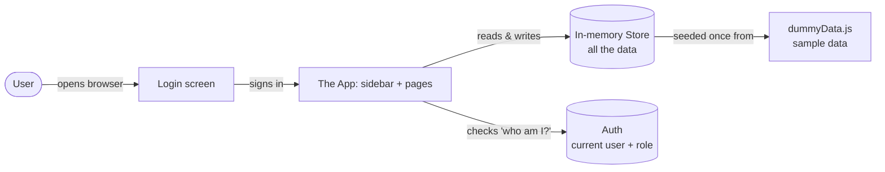

Two invisible "managers" sit behind every screen:

- **Auth** — remembers *who is logged in* and *what they're allowed to do*.
- **Store** — holds *all the data* (products, stock, orders…) and the actions to change it.

Every page simply **reads** from these two managers and **asks them to make changes**.

---

## 3. Technology used (and why)

| Technology | What it is | Why it's here |
|---|---|---|
| **React** | A library for building user interfaces out of reusable "components" | Lets us build each screen from small, reusable pieces |
| **Vite** | A fast development server & build tool | Runs the app locally and packages it for production |
| **React Router** | Handles navigation between "pages" without reloading the browser | Makes the sidebar links switch screens instantly |
| **React Context** | React's built-in way to share data across many components | Powers the Auth and Store "managers" |
| **Plain CSS** | Styling in one stylesheet (`index.css`) | Keeps it simple — no extra styling libraries |
| **Inline SVG** | Hand-drawn icons & charts in code | No chart/icon library needed — fewer dependencies |

> There are **no heavy external libraries** for charts or icons — they're drawn by hand in code.
> This keeps the app small and easy to understand.

---

## 4. The complete file map

```
IMS-Frontend/
├── index.html                 # The single HTML page the browser loads first
├── package.json               # Project name, scripts (dev/build), and dependencies
├── vite.config.js             # Vite settings (dev server port 5173, auto-open)
├── README.md                  # How to run the app + feature overview
├── Flow.md                    # 👈 THIS document
├── docs/
│   ├── er-diagram.md          # The data model (entities & relationships)
│   ├── flow.md                # Shorter flow diagrams (navigation, PO/SO lifecycles)
│   └── phase-plan.md          # Roadmap: what's done & what's next
└── src/                       # ALL the application code lives here
    ├── main.jsx               # Entry point — wires everything together & renders
    ├── App.jsx                # The route table (which URL shows which page)
    ├── index.css              # All styling + responsive rules + design tokens
    │
    ├── auth/                  # The "who is logged in?" manager
    │   ├── AuthContext.jsx    # Login/logout, demo accounts, roles & permissions
    │   └── RequireAuth.jsx    # A gate that blocks pages unless you're logged in
    │
    ├── store/                 # The "all the data" manager
    │   └── StoreContext.jsx   # Holds data in memory + add/adjust actions
    │
    ├── data/
    │   └── dummyData.js       # The original sample data + chart numbers
    │
    ├── components/            # Reusable building blocks shared across pages
    │   ├── Layout.jsx         # The frame: sidebar (with icons) + top bar
    │   ├── Icons.jsx          # Hand-drawn SVG icons for the sidebar
    │   ├── Charts.jsx         # Hand-drawn SVG bar / line / donut charts
    │   ├── Modal.jsx          # A pop-up dialog box
    │   ├── FormModal.jsx      # A pop-up form (used by all "+ New" buttons)
    │   ├── DataTable.jsx      # A generic table for showing lists
    │   ├── Badge.jsx          # A small colored status pill
    │   └── PageHeader.jsx     # The title + action buttons at the top of each page
    │
    └── pages/                 # One file per screen
        ├── Login.jsx          # Sign-in screen
        ├── Dashboard.jsx      # Overview with stat cards + charts
        ├── Products.jsx       # Product list + search + "New Product" form
        ├── Inventory.jsx      # Stock per warehouse + "Adjust Stock" form
        ├── Warehouses.jsx     # Warehouse list + "New Warehouse" form
        ├── Suppliers.jsx      # Supplier list + "New Supplier" form
        ├── PurchaseOrders.jsx # Buying orders + "New PO" form
        ├── Customers.jsx      # Customer list + "New Customer" form
        ├── SalesOrders.jsx    # Selling orders + "New SO" form
        └── Reports.jsx        # Low-stock + stock valuation report
```

**The golden rule of this codebase:**
> `pages/` = screens you see. `components/` = reusable pieces screens are built from.
> `auth/` + `store/` = the shared "managers". `data/` = the sample numbers. Everything else
> is configuration.

---

## 5. How the app boots up (startup flow)

When you open the app, files load in this exact order:

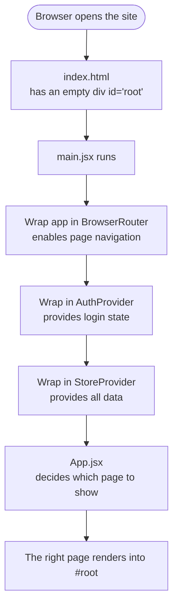

**In words:**

1. **`index.html`** is the only real HTML file. It contains an empty box: `<div id="root">`.
   It also loads `main.jsx`.
2. **`main.jsx`** is the starting line of the JavaScript. It wraps the whole app in three layers
   (think of them as nested boxes):
   - `BrowserRouter` → makes URLs/navigation work.
   - `AuthProvider` → makes "who is logged in" available everywhere.
   - `StoreProvider` → makes "all the data" available everywhere.
   Then it renders `App` into the `#root` box.
3. **`App.jsx`** looks at the current URL and shows the matching page.

> **Why the nesting order matters:** the Store and Auth boxes are *inside* the Router box, so
> every page can both navigate *and* read the shared data/login. Pages are inside all three, so
> they get all three superpowers.

Relevant code (`src/main.jsx`):

```jsx
<BrowserRouter>
  <AuthProvider>
    <StoreProvider>
      <App />
    </StoreProvider>
  </AuthProvider>
</BrowserRouter>
```

---

## 6. The two "brains": Auth and Store

These two files are the heart of the app. Almost everything else just talks to them.

### 6a. Auth — `src/auth/AuthContext.jsx`

This is the **"who is logged in and what can they do?"** manager.

**What it contains:**

- **`DEMO_USERS`** — three pretend accounts (no real server):

  | Username  | Role    |
  |-----------|---------|
  | `admin`   | Admin   |
  | `manager` | Manager |
  | `staff`   | Staff   |

  The password for all of them is `demo`.

- **`PERMISSIONS`** — a list of what each role may do:

  | Role    | view | create | edit | adjust | manageUsers |
  |---------|:----:|:------:|:----:|:------:|:-----------:|
  | Admin   | ✅ | ✅ | ✅ | ✅ | ✅ |
  | Manager | ✅ | ✅ | ✅ | ✅ | ❌ |
  | Staff   | ✅ | ❌ | ❌ | ❌ | ❌ |

- **Functions it gives the app:**
  - `login(username, password)` → checks the credentials; on success, remembers the user.
  - `logout()` → forgets the user.
  - `can(action)` → returns true/false, e.g. `can('create')`. Pages use this to **show or hide
    buttons** based on role.
  - `user` → the currently logged-in person (or nothing if logged out).

- **Remembering the session:** the logged-in user is saved to the browser's **`localStorage`**
  (a small permanent notepad in the browser). So if you refresh, you stay logged in.

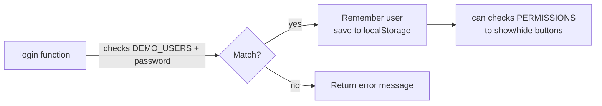

### 6b. Store — `src/store/StoreContext.jsx`

This is the **"all the data"** manager. It is the single source of truth for everything the app
displays.

**What it holds (all loaded once from `dummyData.js`):**

- `products`, `warehouses`, `suppliers`, `customers`
- `purchaseOrders`, `salesOrders`
- `stockLevels` (how much of each product is in each warehouse)
- `stockMovements` (a running log of every stock change)

**Actions it offers (these *change* the data):**

| Action | What it does |
|---|---|
| `addProduct(p)` | Adds a new product to the top of the list (auto-assigns an id) |
| `addWarehouse(w)` | Adds a new warehouse |
| `addSupplier(s)` | Adds a new supplier |
| `addCustomer(c)` | Adds a new customer |
| `addPurchaseOrder(po)` | Adds a new purchase order |
| `addSalesOrder(so)` | Adds a new sales order |
| `adjustStock({...})` | The most powerful one — see below |

**`adjustStock` does three things at once:**

1. Updates the **stock level** for that product in that warehouse (goes up for `IN`, down for `OUT`).
2. Updates the product's overall **on-hand** quantity.
3. Adds an entry to the **stock movements** log (the audit trail), stamped with the current date.

**Derived (auto-calculated) values:**

- `lowStockProducts` — products at or below their reorder level.
- `dashboardStats` — the summary numbers on the dashboard (totals, low-stock count, stock value).
  These **recompute automatically** whenever the underlying data changes.

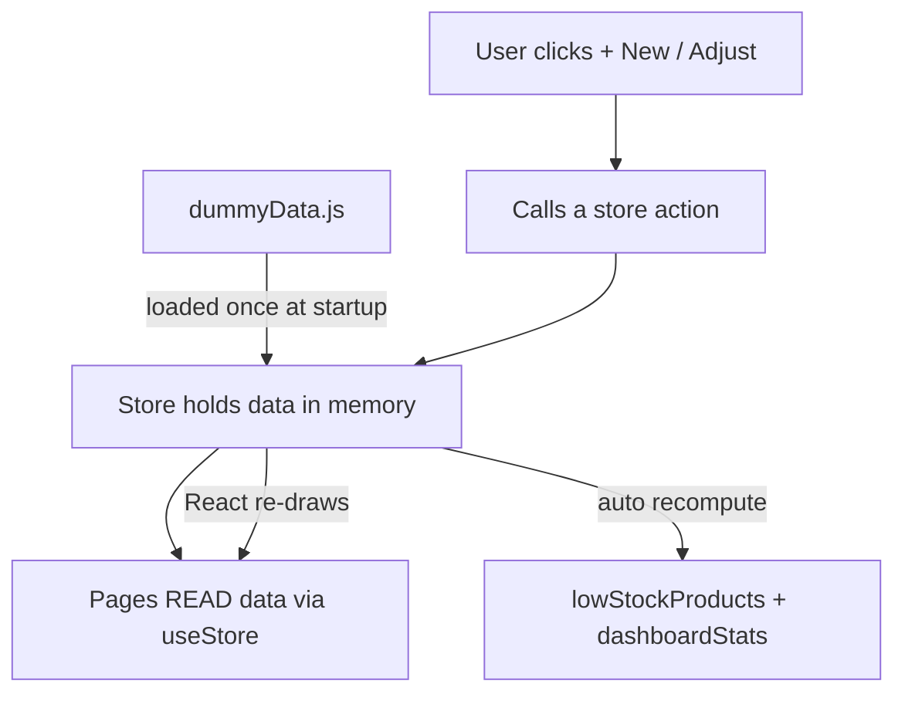

> **Key idea:** When a store action changes the data, React **automatically re-draws** every
> screen that uses that data. That's why a newly added product appears in the table instantly —
> no manual refresh needed.

---

## 7. Routing: how URLs map to screens

`src/App.jsx` is the **route table**. It says "this URL → that page".

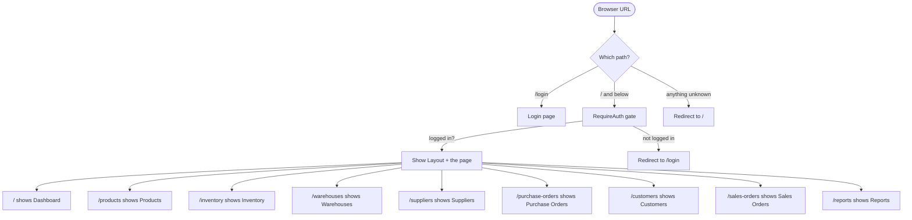

**How it works:**

- `/login` is **public** — anyone can see it.
- Everything else is wrapped in **`RequireAuth`** (`src/auth/RequireAuth.jsx`). This is a
  **security gate**: if you're not logged in, it sends you to `/login` and remembers where you
  were trying to go. After you log in, it sends you back there.
- All logged-in pages render *inside* the **`Layout`** (sidebar + top bar). The specific page
  appears in the Layout's content area (React Router calls this the `<Outlet />`).
- Any unknown URL redirects to the home page (`/`).

---

## 8. The shared building blocks (components)

Pages don't reinvent the wheel — they're assembled from these reusable pieces.

### `Layout.jsx` — the app frame
The persistent shell around every logged-in page:
- **Sidebar** with the brand (📦 IMS), 9 navigation links (each with an **icon** + label), and a
  **Sign out** button at the bottom.
- **Top bar** with a ☰ menu button (mobile only), the app title, and the logged-in user's name +
  role badge.
- On mobile, the sidebar hides and slides in when you tap ☰; a dark **backdrop** appears behind
  it and closes it when tapped.
- The actual page content is dropped into `<Outlet />`.

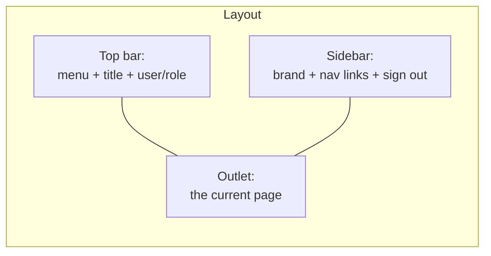

### `Icons.jsx` — the icon set
A collection of small **hand-drawn SVG icons** (Dashboard, Products, Inventory, Warehouse,
Supplier, Purchase, Customer, Sales, Reports, Logout). They inherit the surrounding text color,
so they automatically match the sidebar's styling (e.g. turn white when a link is active).

### `Charts.jsx` — the dashboard charts
Three **hand-drawn SVG charts**, no external library:
- **`BarChart`** — vertical bars (used for monthly purchases).
- **`LineChart`** — a trend line with a soft shaded area (used for sales).
- **`DonutChart`** — a ring split into colored segments + a legend (used for stock by category).

They scale to fit their container, so they look right on phone and laptop. Hovering a bar/point/
segment shows a tooltip with the exact value.

### `Modal.jsx` — the pop-up dialog
A reusable pop-up box. It darkens the background, can be closed by pressing **Escape** or clicking
outside it, and has a title, a body, and a footer for buttons.

### `FormModal.jsx` — the universal form
This is the workhorse behind **every "+ New" button**. You give it a **list of fields** (a
"schema"), and it builds the whole form for you — text boxes, dropdowns, number inputs, and
checkboxes. It:
- Validates **required** fields (shows "Required" if you leave one blank).
- Converts number fields to actual numbers.
- Calls your `onSubmit` function with the finished values, then closes itself.

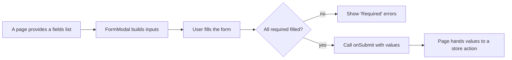

### `DataTable.jsx` — the generic table
Shows any list as a table. You give it `columns` (what headings to show and how to render each
cell) and `rows` (the data). If there's no data, it shows a friendly empty message. It scrolls
sideways on small screens so columns never get squished.

### `Badge.jsx` — the status pill
A tiny colored label, e.g. a green "Active" or amber "Low". Just pick a color and text.

### `PageHeader.jsx` — the page title bar
The top of each page: a **title**, an optional **subtitle**, and a slot on the right for action
buttons (like search boxes and "+ New" buttons). It wraps neatly on small screens.

---

## 9. Every page, explained

All list pages follow the **same recipe**:
> Read data from the Store → show it in a `DataTable` → if the user `can('create')`, show a
> "+ New" button that opens a `FormModal` → on submit, call a store action.

### `Login.jsx`
The sign-in screen (the only page you can see logged out).
- Username + password fields, plus three **role shortcut buttons** that prefill the form.
- On submit, it calls `login()`. If correct, it sends you to where you were headed (or the
  Dashboard). If wrong, it shows an error.
- If you're *already* logged in, it skips straight to the app.

### `Dashboard.jsx`
The overview screen. It shows:
- **Six stat cards** (Products, Active Warehouses, Low Stock Items, Open POs, Open SOs, Stock Value)
  — all pulled from the auto-calculated `dashboardStats`.
- **Three charts** — purchases-vs-sales line, monthly purchases bar, stock-by-category donut.
- **Low stock alerts** table and **Recent stock movements** table.

### `Products.jsx`
- Lists products in a table (SKU, name, category, prices, on-hand, status).
- A **search box** filters by SKU or name as you type.
- **"+ New Product"** (Admin/Manager only) opens a form to add a product; it appears instantly.

### `Inventory.jsx`
- A **warehouse dropdown** at the top; the table shows stock for the selected warehouse
  (quantity, reserved, and calculated **available** = quantity − reserved).
- **"+ Adjust Stock"** (Admin/Manager only) opens a form to add/remove/adjust stock. On submit it
  calls `adjustStock`, which updates the level, the product's on-hand, **and** logs a movement.

### `Warehouses.jsx`, `Suppliers.jsx`, `Customers.jsx`
- Simple list + "+ New …" form. Warehouses and Suppliers also show an Active/Inactive badge.

### `PurchaseOrders.jsx` (buying) and `SalesOrders.jsx` (selling)
- List orders with a colored **status badge** (DRAFT / APPROVED / RECEIVED / SHIPPED…).
- "+ New PO/SO" forms let you pick a supplier/customer + warehouse, set a date and total, and a
  status. The supplier/customer/warehouse dropdowns are **populated live from the Store**, so any
  warehouse you just created is immediately selectable.

### `Reports.jsx`
- **Low stock** table (items at/below reorder level).
- **Stock valuation** table (quantity × unit cost per product) with a grand total.

---

## 10. The data layer explained

### `src/data/dummyData.js` — the seed data
This file is the **starting data** the app loads once at boot. It contains:
- Reference lists: `categories`, `units`.
- Core records: `warehouses`, `products`, `stockLevels`, `stockMovements`, `suppliers`,
  `purchaseOrders`, `customers`, `salesOrders`.
- **Color maps**: `statusColor` (order statuses → badge colors) and `movementColor` (movement
  types → colors).
- **Chart numbers**: `monthlyTrend` (purchases vs sales over 6 months) and `stockByCategory`
  (stock value per category).

> **Important:** The shapes of these objects are deliberately designed to match what a real
> backend API would return. That makes swapping in a real server later a near drop-in change.

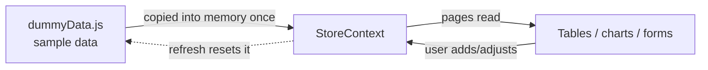

### Relationship between the data (simplified)

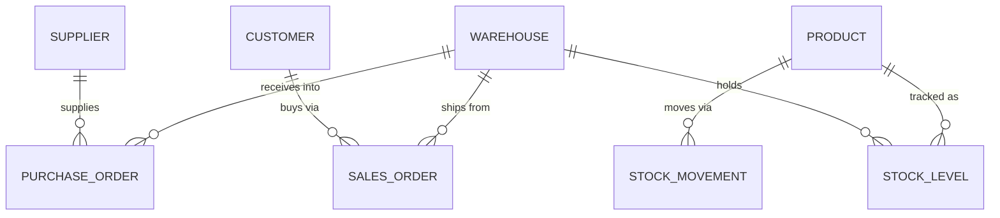

In plain words: a **warehouse** holds **stock levels** of **products**; **suppliers** sell to us
via **purchase orders** (received into a warehouse); **customers** buy from us via **sales
orders** (shipped from a warehouse); and every change to stock is recorded as a **stock movement**.

---

## 11. Styling & responsiveness

All styling lives in **`src/index.css`**. Highlights:

- **Design tokens** at the top (`:root`) — colors, spacing, border radius, shadows — defined once
  and reused everywhere. Change a color here and it updates across the whole app.
- **Component styles** — buttons, inputs, cards, tables, badges, the sidebar/top bar, modals,
  forms, charts, and the login screen.
- **Responsiveness** via two breakpoints:
  - **≤ 860px (tablet/large phone):** the sidebar becomes a slide-in drawer behind the ☰ button;
    a dark backdrop appears; content padding shrinks.
  - **≤ 560px (phone):** smaller text, forms collapse to a single column, header controls go
    full-width, and the user's name hides (only the role badge shows).

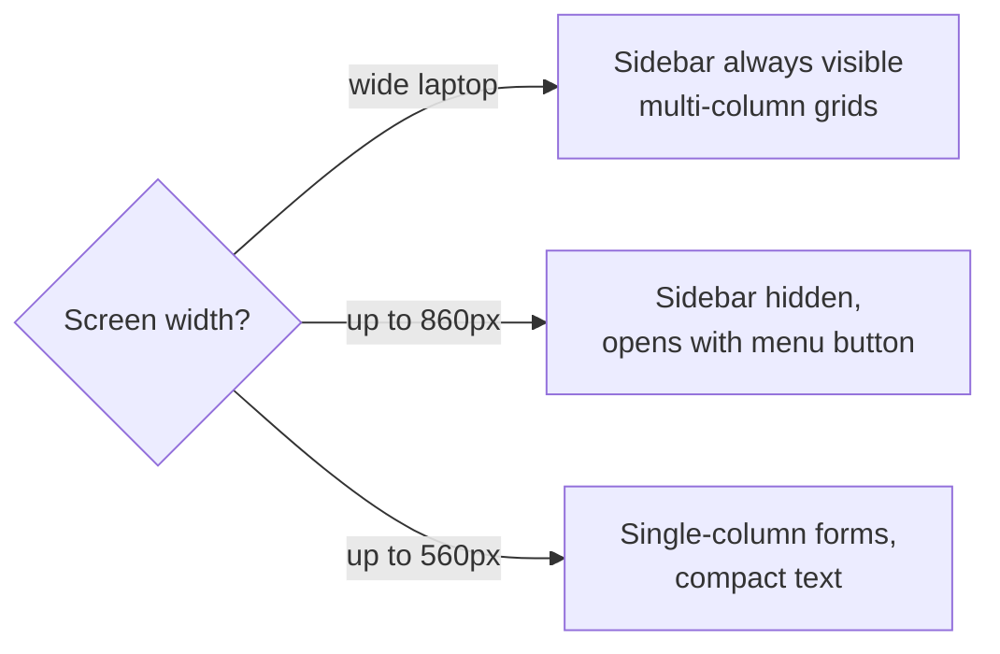

> **Tables** always scroll sideways inside their container, so even a wide table never breaks the
> mobile layout.

---

## 12. End-to-end user journeys (step by step)

These walkthroughs tie everything together. Follow the numbered steps and the file involved.

### Journey A — Logging in

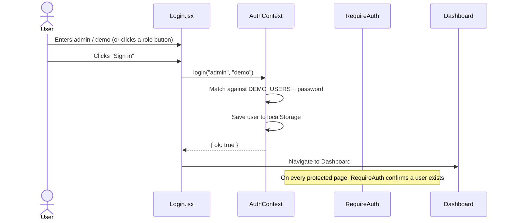

1. You open the app → `RequireAuth` sees no user → redirects to **`/login`**.
2. You type credentials (or click **Admin/Manager/Staff** to prefill) and click **Sign in**.
3. `Login.jsx` calls `login()` in **AuthContext**.
4. AuthContext checks the demo accounts. On success it **remembers you** (and saves to
   `localStorage`).
5. You're sent to the Dashboard. Refreshing the page keeps you logged in.

### Journey B — Adding a new Warehouse (the template for all "+ New" buttons)

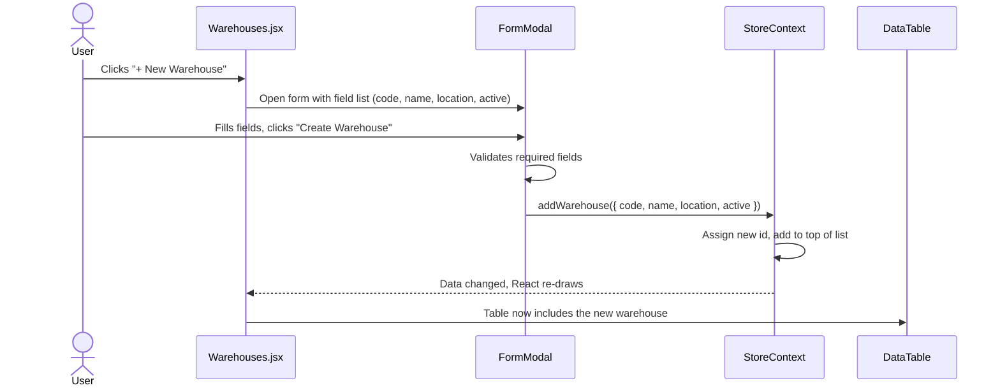

1. Click **"+ New Warehouse"** (visible only if your role `can('create')`).
2. `Warehouses.jsx` opens a **`FormModal`**, handing it the field list.
3. You fill the form and submit. FormModal validates and calls **`addWarehouse`** in the Store.
4. The Store assigns a new id and adds the warehouse to the list.
5. React notices the data changed and **re-draws the table** — the new warehouse appears instantly.

> **Every** "+ New" page (Products, Suppliers, Customers, Purchase Orders, Sales Orders) follows
> this exact pattern — only the field list and the store action differ. This is why "add feature
> works like add warehouse" across the whole app.

### Journey C — Adjusting stock (the most connected flow)

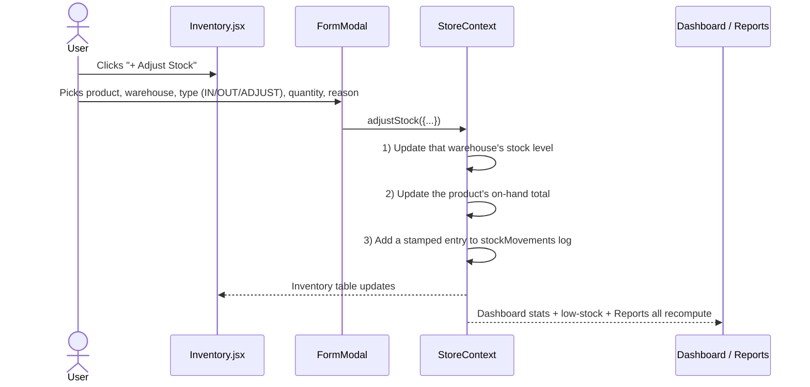

1. On **Inventory**, click **"+ Adjust Stock"**.
2. Pick the product, warehouse, movement type, quantity, and reason.
3. The Store's `adjustStock` updates **three things at once**: the warehouse stock level, the
   product's on-hand quantity, and the movements log.
4. Because the Dashboard's stats and the Reports page are **derived** from this same data, they
   **all update automatically** — low-stock alerts may clear, stock value changes, and the new
   movement shows on the Dashboard.

### Journey D — Navigating between pages

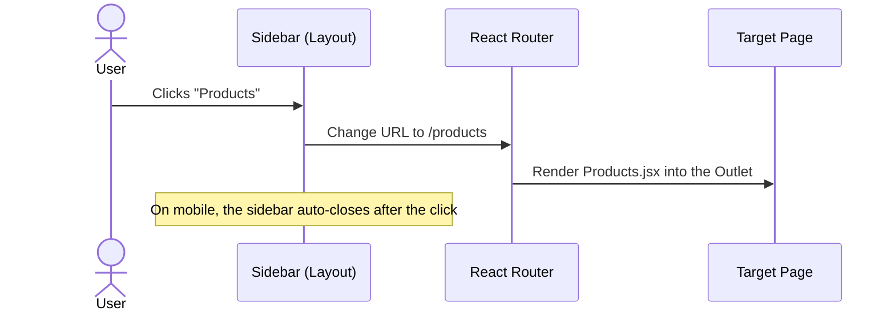

The sidebar links don't reload the browser — React Router swaps the page content instantly while
keeping the sidebar and top bar in place.

### Journey E — A complete business cycle (the real-world "why")

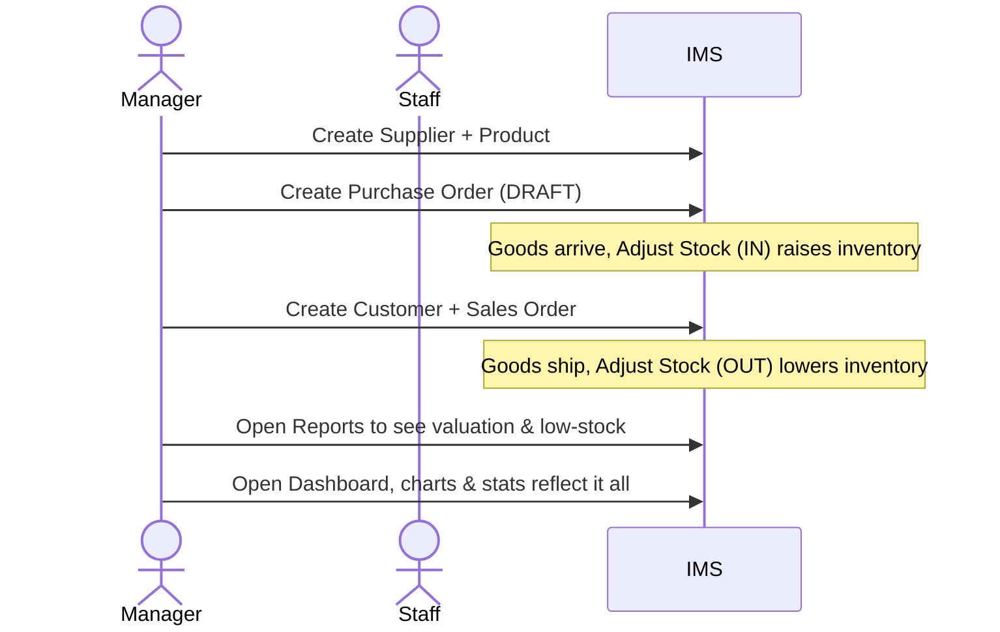

---

## 13. Roles & permissions cheat sheet

| You log in as | You can… | "+ New" / "Adjust" buttons |
|---|---|---|
| **Admin** | Do everything | **Visible** |
| **Manager** | View + create + adjust stock | **Visible** |
| **Staff** | **View only** | **Hidden** |

How it works in code: each page wraps its action button in `can('create')` or `can('adjust')`.
If the function returns false (e.g. for Staff), the button simply isn't rendered. The data and
tables are still fully visible to everyone.

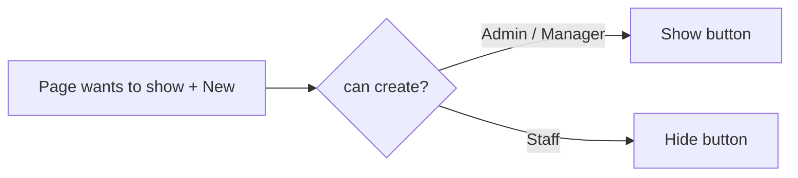

---

## 14. Frequently asked "how does X work?"

**Q: Where is the data actually stored?**
In the browser's memory (the **Store**). It's copied from `dummyData.js` once at startup. There
is no database, so a full page refresh resets it to the original sample data.

**Q: Why does a new product show up instantly without refreshing?**
Because React **automatically re-draws** any screen that reads data which just changed. When the
Store's list updates, every table using it redraws.

**Q: How does the app know who I am after I refresh?**
The logged-in user is saved in the browser's **`localStorage`**. On startup, AuthContext reads it
back, so you stay signed in until you click **Sign out**.

**Q: Where do the charts get their numbers?**
From `monthlyTrend` and `stockByCategory` in `dummyData.js`. The charts themselves are drawn by
`Charts.jsx` using plain SVG — no chart library.

**Q: How would we connect a real backend later?**
Replace the Store's seed data and its `add*`/`adjustStock` actions with calls to a real server
(e.g. via `fetch`/axios), and swap the demo `AuthContext` for real login. Because the data shapes
already match a planned API, the rest of the app barely changes.

**Q: What makes it responsive?**
CSS rules in `index.css` at two screen-width breakpoints (860px and 560px) that collapse the
sidebar, stack forms, and resize text for phones.

---

## 15. Glossary

| Term | Plain-English meaning |
|---|---|
| **Component** | A reusable building block of the UI (a button, a table, a page) |
| **Page** | A full screen (Dashboard, Products, etc.) |
| **Route** | The rule connecting a URL to a page |
| **Context / Provider** | React's way of sharing data (like Auth or Store) with all components |
| **Store** | The in-memory holder of all app data + the actions to change it |
| **Auth** | The manager of who's logged in and what they're allowed to do |
| **Seed data** | The starting sample data (`dummyData.js`) |
| **SKU** | Stock Keeping Unit — a product's unique code |
| **On-hand** | How many units of a product you currently have |
| **Reorder level** | The threshold below which a product is "low stock" |
| **Stock level** | How much of a product is in a *specific* warehouse |
| **Stock movement** | A logged change to stock (IN / OUT / TRANSFER / ADJUST) |
| **PO / Purchase Order** | A document for *buying* stock from a supplier |
| **SO / Sales Order** | A document for *selling* stock to a customer |
| **Valuation** | The total money value of stock on hand |
| **Modal** | A pop-up dialog box |
| **localStorage** | A small permanent notepad inside the browser |
| **SVG** | A way to draw crisp graphics (icons, charts) with code |
| **Responsive** | Layout that adapts to phone, tablet, and laptop screens |

---

### One-paragraph summary (for the elevator pitch)

> The IMS frontend is a React app. When it loads, `main.jsx` sets up navigation and two shared
> "managers" — **Auth** (who's logged in + their role) and **Store** (all the data). You sign in
> on the **Login** page; a gate called **RequireAuth** keeps everyone else out. Inside, a
> **Layout** (sidebar + top bar) frames nine pages. Every page reads data from the Store and shows
> it in tables and charts; "+ New" buttons open a reusable **FormModal** that calls a Store action
> to add records, and the screens update instantly. Roles decide which buttons appear. All data
> is sample data held in memory, shaped to match a future real backend — so going live later is a
> straightforward swap.
